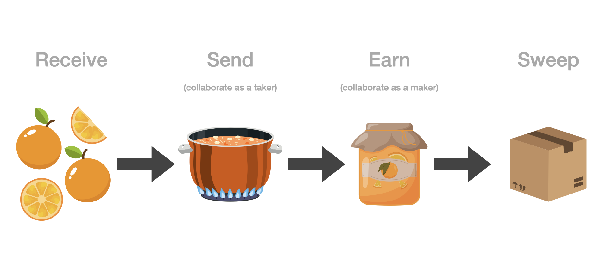

# Cheat Sheet

While everyone will use Jam differently, here is one way you can think about the
general application flow:

Some of your [UTXOs][utxo] might be chunky and identifiable, like whole or large
pieces of fruit. Once you make delicious jam out of them, they are less chunky
and less identifiable. You are free to offer your fruits to others so they can
make jam more easily.

Without the fruity metaphor: to increase the privacy and fungibility of your
funds, you should use Jam as both a [market maker][maker] ('Earn' tab) and a
[taker][taker] ('Jam' tab). Use a Jar's sweep functionality or the [Jam
Scheduler][jam] to transfer funds out of Jam, e.g. to move all your funds to
cold storage or to use them to open lightning channels. If you want to pay
others for goods and services, use [send][send].

[utxo]: /glossary/#utxo
[maker]: /glossary/#maker
[taker]: /glossary/#taker

## First Use

1. [Receive][receive] sats to fund your wallet
2. [Jam][jam] it up with the Jam scheduler
3. [Earn][earn] sats by offering liquidity[^fnfb]
4. [Send][send] a collaborative transaction
5. Rinse and repeat!

[^fnfb]: Make sure to create a [fidelity bond][fb] to increase the chances of your offer being taken.

[receive]: 01-receive.md
[jam]: 02-jam.md
[earn]: 03-earn.md
[send]: 04-send.md
[fb]: fidelity-bonds.md

## Things to Note
