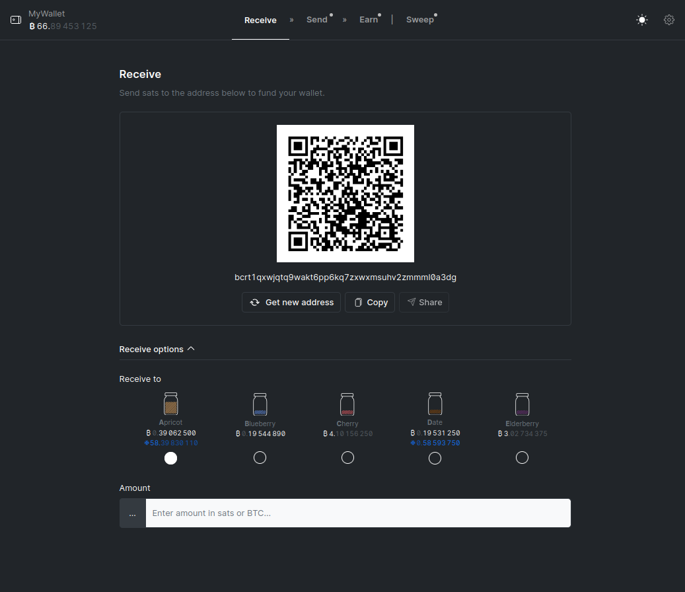

# Receive

Use the 'Receive' tab to receive funds.

A new [invoice address][address] will be generated every time. You can scan the
QR code with a mobile wallet or copy/paste the invoice address to receive funds
from someone else, or send funds from another wallet yourself.

!!! info
    Jam uses [jars][jars] under the hood to separate funds into disconnected
    containers. Think of jars as different pockets in your wallet, or different
    identities. The default jar to receive funds is *Jar #0*.

Once you have funded your wallet, you can use the 'Jam' tab to schedule
collaborative transactions.

[jars]: /glossary/#jar
[address]: /glossary/#address

[:octicons-arrow-right-24: Jam][jam]

[jam]: 02-jam.md
