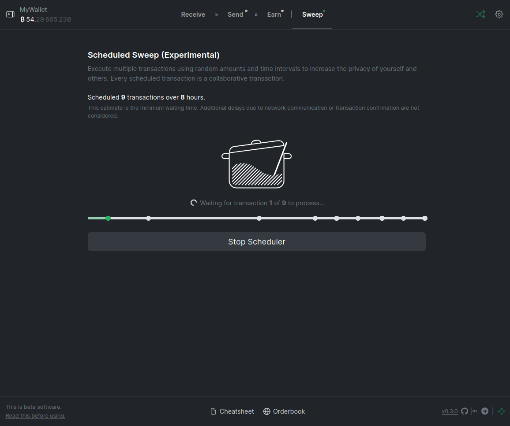

# Jam

Use the 'Jam' tab to schedule multiple collaborative transactions.

Once 'Jam' is active, you will see a green indicator light which means that the
scheduler service is running.

You can stop the scheduler at any time.

[:octicons-arrow-right-24: Earn][earn]

[earn]: 03-earn.md
