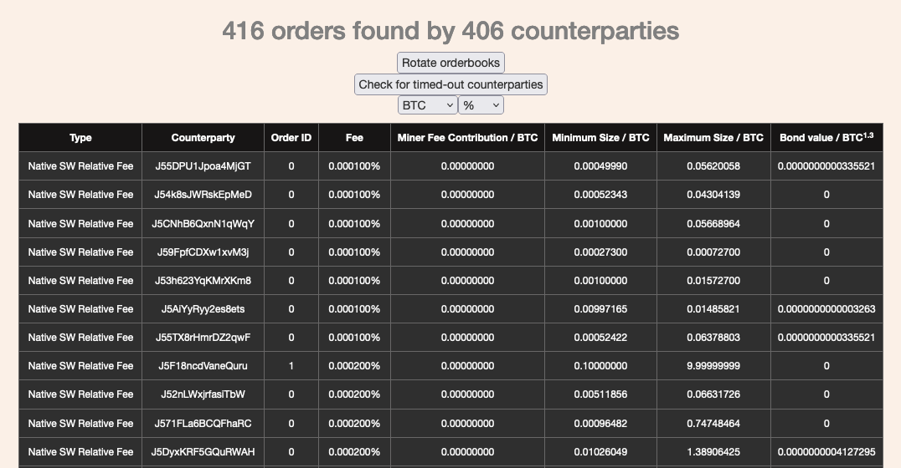

# Orderbook

The order book (or orderbook) shows what kind of offers are currently on the
market. It gives insights in regards to offer types, [fees][fees], offer sizes, and
[fidelity bonds][fb] put up by [market makers][makers].

[fees]: fees.md
[fb]: ../glossary.md#fidelity-bond
[makers]: ../glossary.md#maker

Jam will set up a service that allows you to watch the order book on your node.
This removes the trust in a third party. You can view the order book on your
node. It is available via port `62601` by default.[^jm-orderbook]

[^jm-orderbook]: Refer to the [Joinmarket documentation](https://github.com/JoinMarket-Org/joinmarket-clientserver/blob/master/docs/orderbook.md) for details.

There are also public order books that you can inspect, in case you do not have
access to your own node:

[:octicons-arrow-right-24: nixbitcoin.org/orderbook][nixbitcoin]

[nixbitcoin]: https://nixbitcoin.org/orderbook/
