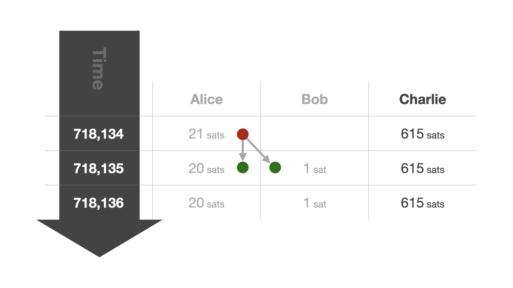

# Fundamentals

When it comes to Bitcoin, misconceptions abound. This is not surprising. Bitcoin
is a new thing, and, consequently, all [metaphors][metaphors] and comparisons
fall short, in one way or another.

[metaphors]: https://dergigi.com/terminology

One misconception is that Bitcoin is private and untraceable. In actuality,
regular Bitcoin use often has weaker privacy guarantees than using the
traditional banking system, as Gregory Maxwell pointed out [many years][maxwell]
ago:

[maxwell]: https://bitcointalk.org/?topic=279249

> “Your inlaws can see that you're buying birth control that deprives them of
> grandchildren, your employer learns about the non-profits you support with money
> from your paycheck, and thieves see your latest purchases and how wealthy you
> are which helps them target and scam you. Poor privacy in Bitcoin can be a major
> practical disadvantage for both individuals and businesses.”

To understand why this is, we have to understand how Bitcoin operates. This,
however, turns out to be very difficult. To understand one part, one needs to
have a solid understanding of computer science and cryptography. To understand
another part, one needs to have a solid understanding of economics and game
theory—not to mention money, networks, governance, energy and energy markets,
monetary history, and so on. The list of relevant disciplines is almost endless.

However, it is possible to look at some parts of Bitcoin in isolation
and—hopefully—gain a better understanding by zooming in. One such part is the
Bitcoin transaction.

## The Bitcoin Transaction

In the simplest sense, a Bitcoin transaction is just a bunch of data that
describes the movement of bitcoins.

A bitcoin transaction consists of inputs and outputs. Every transaction input
refers to the output of a previous transaction. We say that an input "consumes"
an output. If an output is not consumed yet, we speak of an unspent transaction
output, or UTXO, for short.

Once properly understood, it is easy to see what the Bitcoin network generates:
a linked data structure that, starting from a common root—the genesis
block—splits and combines bundles of sats as time goes on. Properly visualized,
it would look a bit like an upside-down tree.

Every transaction has at least one input and at least one output. The simplest
and traditionally most common transaction type has one input and two outputs:
one describing the actual payment and one describing the change that goes back
to the one who initiated the payment.

The concept of change is required because Bitcoin doesn't allow an update of the
past. It is an append-only log, so instead of going back and modifying past
entries, new entries have to be created to reflect any updates. Transactions are
what create these updates. For a simple transaction, one new "entry" is created
to update the balance of the receiver, and one new entry is created to update
your own balance. You can think of it as paying for something that costs $5 with
a $20 bill. The merchant receives five dollars, and you get $15—the change—back.
However, we don't have physical coins and bills, we only have an append-only
log. So instead of bills of smaller denominations, new entries—new UTXOs—are
created.

While this design is ingenious when it comes to validation—you can easily make
sure that everything adds up at all times—there are certain nuances to consider
when it comes to privacy.

For example, if it is trivial to determine which output is a change output and
which one isn't, it is trivial to cluster outputs and thus identify not only the
flow of funds, but also who transacted with whom, at what times, and—of
course—the amounts that were transacted. Imagine a data leak that exposes all
transactions of every company, every individual, every politician, every bank,
every merchant, every online shop, and every vending machine. When used naively,
this data leak is Bitcoin.

Luckily, the situation is not as grim as it sounds. Developments and techniques
exist to remedy this situation. To understand them, we have to understand the
various transaction types that Bitcoin allows.

## Bitcoin Transaction Types

We already discussed the most common transaction type: the "simple spend." There
are also transactions that have only one input and one output, transactions that
have multiple inputs and one output, and transactions that have multiple inputs
and multiple outputs. Let's call them "No Change," "Consolidation," and "Batch,"
respectively.

While Bitcoin's transaction graph is public, it is important to point out that
any analysis that is applied to this data is heuristic. For example, a user
might create a transaction that splits a UTXO in half, resulting in two outputs
that belong to the same entity. Or, to pick another example, a regular spend
might produce two outputs that are exactly equal, making change detection
virtually impossible.

Because identification can only happen heuristically, one part of the solution
to Bitcoin's privacy conundrum lies in collaboration.

## Collaborative Transactions

When it comes to privacy, collaboration is the norm. Take encryption, for
example. If you want to have a secure communications channel with another party,
you start a collaborative process. You meet, you exchange secret information,
and you use this secret information to encrypt your messages. We call this
exchange of secret information a "handshake," and over the last decades, we
implemented all kinds of handshakes into our communication and networking
protocols to make sure that bad actors can't eavesdrop on our communications.

Similarly, cryptographers and security researchers are currently working on
protocols and techniques that make sure that bad actors can't eavesdrop on your
every financial move. As with end-to-end encryption, these protections are
important for all and a matter of life-and-death for some. Dissidents,
journalists, whistleblowers, political activists—these are only a few groups of
people that depend on secure communications, which includes financial
communication. That privacy is important for these groups is an understatement.
It is absolutely essential. This is also why the [Human Rights Foundation][hrf]
launched a fund to support software developers who are making the Bitcoin
network more private, decentralized, and resilient.

[hrf]: https://hrf.org/devfund

So, how can we think about a "handshake" in the world of bitcoin transactions?
It's quite simple, really. As mentioned above, a bitcoin transaction can have
multiple inputs and multiple outputs. The privacy techniques that are currently
being developed are making use of this feature. The interesting part is that not
all inputs have to be controlled by the same party. Thus, the "handshake" is
about bringing multiple parties together to collaborate on a bitcoin
transaction.

Once the collaborating parties agree on the parameters of the transaction, the
transaction is signed by all parties and broadcast to the network. Because of
the heuristical nature of transaction analysis, an onlooker won't be able to
figure out the flow of funds.

One especially promising technique to increase the privacy of all is to combine
the above with an actual payment. In this scenario, the "handshake" is about
bringing a merchant and a customer together to craft a special transaction that
can only be deciphered by said merchant or customer. An eavesdropper is left
with multiple interpretations of the transaction, each equally likely. Such a
transaction is called a “[PayJoin][payjoin].”

[payjoin]: /glossary/#payjoin

Even if only a small percentage of transactions are PayJoin transactions, the
privacy of all participants in the network is increased substantially.

As more wallets and merchants adopt and support these privacy features, we will
see a substantial increase in privacy on Bitcoin's base layer. However, as we
have seen with the adoption of Transport Layer Security on the Internet, it
takes some time for an upgrade of this sort to be implemented and embraced.

## Transport Layer Security

When the internet was a new thing, we didn't think that it would envelop all our
communications and all our lives. Encryption was an afterthought. After a while,
however, we figured out that having all our communications available in plain
text, readable by everyone who had the interest and technical proficiency to do
so, wasn't a terribly good idea. Consequently, we made a concerted effort to
change things. We upgraded [from HTTP to HTTPS][https] and from plain text
messages to end-to-end encryption. While this switch isn’t [100%][percent]
complete yet, encrypted communication became the default over time. This upgrade
took a long time, since, similar to Bitcoin, nobody is in charge of the
internet.

<!-- TODO: Segue, ending? -->

---

[:octicons-arrow-right-24: Best Practices][best-practices]

[best-practices]: /privacy/02-best-practices

[https]: https://dergigi.com/https
[percent]: https://transparencyreport.google.com/https/overview?hl=en
